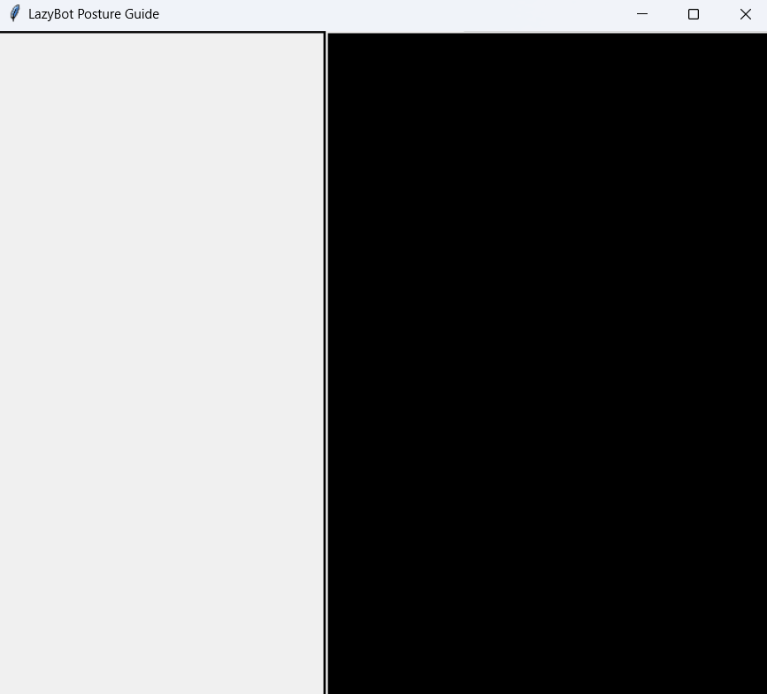
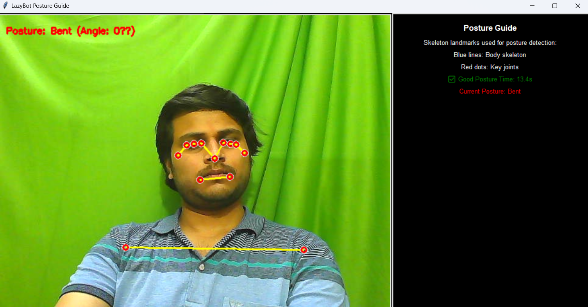
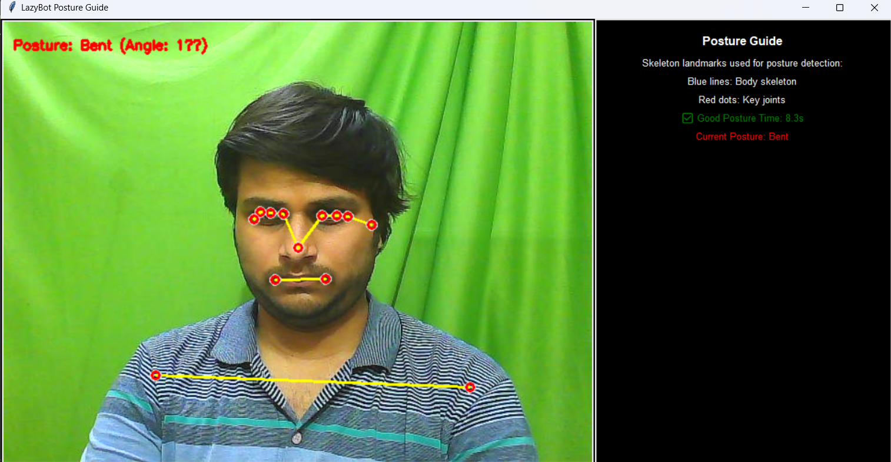

# LazyBot - Real-Time Posture Detection 🎯

  
*Transform your sitting habits with real-time posture monitoring! 🚀*

## Overview ✨

**LazyBot** is an innovative AI-powered tool designed to monitor and enhance your posture in real-time using a webcam. Built with Python, Mediapipe, and TensorFlow, it accurately classifies your posture as "Straight" or "Bent" and delivers instant feedback to promote healthier sitting habits. Featuring skeleton tracking, advanced posture analysis, and an intuitive Tkinter-based UI, LazyBot is your companion for better ergonomics! 🌿💻

### Key Features 🌟
| Feature                  | Description                                      |
|---------------------------|--------------------------------------------------|
| **Real-Time Detection**   | Classifies posture as "Straight" or "Bent" using a trained neural network. 📡 |
| **Skeleton Tracking**     | Visualizes body landmarks (e.g., shoulders, hips) with Mediapipe for precision. 🦴 |
| **Instant Feedback**      | Displays posture status, spine angle, and time spent in good/bad posture on a sleek UI. 📊 |
| **Customizable**          | Adjustable posture thresholds and settings to suit your needs. ⚙️ |

## Screenshots 📸

### User Interface 🎨
  
*The LazyBot UI showcasing real-time posture detection with skeleton landmarks and dynamic feedback.*

### Posture Detection in Action 🎬
  
  
*Live skeleton tracking and posture classification (Straight/Bent) with accurate angle displays.*

## Installation 🛠️

### Prerequisites
- **Python 3.8+** 🐍
- **Webcam** (required for real-time detection) 📹

### Dependencies
Install the required libraries with a single command:
```bash
pip install -r requirements.txt